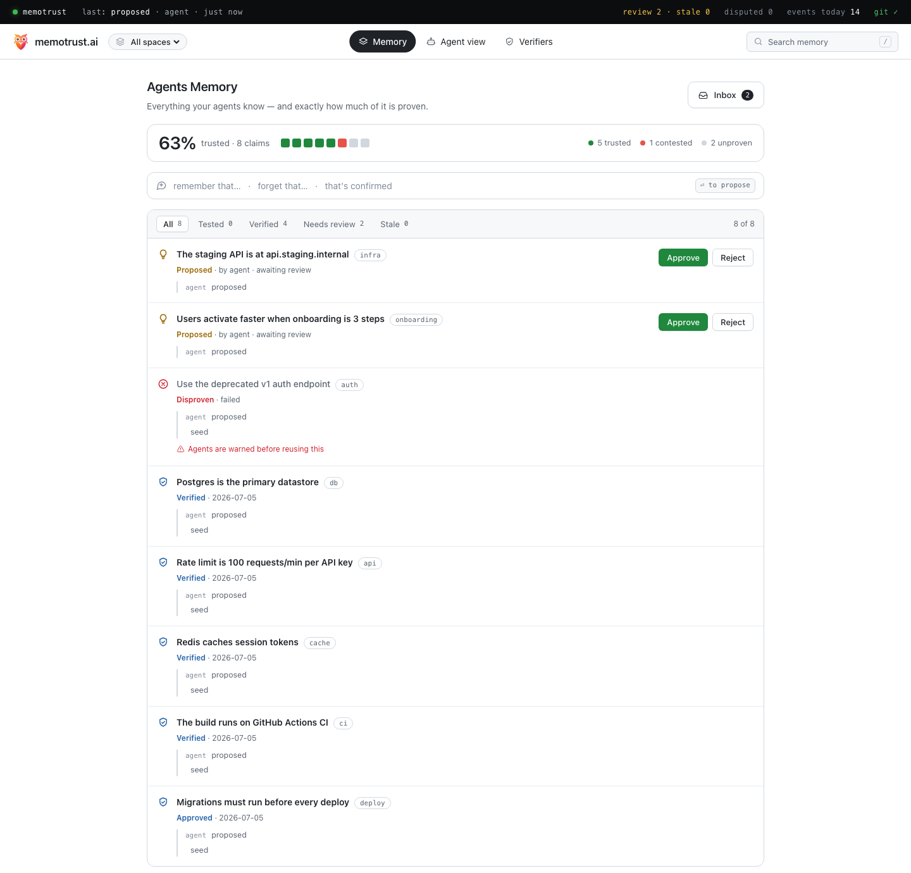
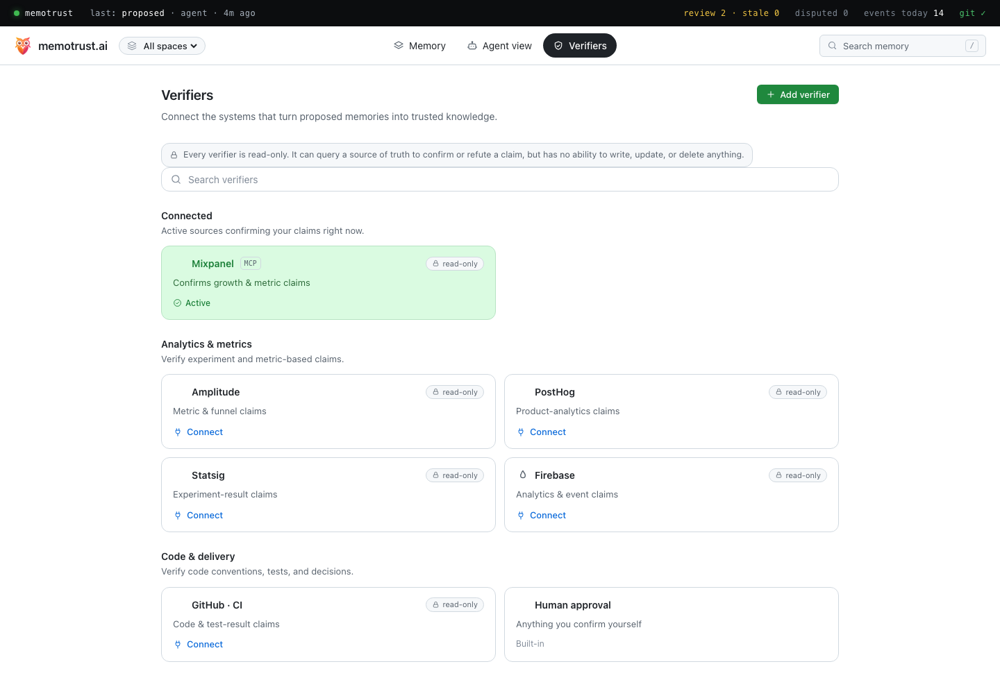

<div align="center">


# memotrust

### Verified memory for AI agents — so your agents remember only what's **true**.

[](https://www.npmjs.com/package/memotrust)
[](LICENSE)
[](https://modelcontextprotocol.io)
[](https://github.com/Idanref/memotrust)

Agents propose memories. **Evidence** verifies them. `recall()` returns only what has *earned* trust — so a hallucinated, stale, or **poisoned** "fact" never reaches your other agents.

<br/>


<br/>

```bash
npx memotrust install
```

</div>

---

## Why memotrust

Give your agents a shared memory and it's a superpower — until one agent hallucinates a fact, copies a stale number, or reads a poisoned note. In every other memory layer, that mistake becomes **every agent's "truth"**, silently, forever. (Memory poisoning is OWASP agentic risk **ASI06**.)

memotrust flips the default: **nothing is trusted on arrival.** A memory reaches `recall()` only after it's **verified against a real source** or **approved by a human**. Trust decays. Disputes withhold. Every verdict keeps a receipt.

## What's inside

| | |
|---|---|
| 🧠 **Trusted recall** | `recall()` returns only verified, fresh, in-scope memory — ranked. No guesses, no stale wins. |
| 🛡️ **Poison can't spread** | Every new memory is quarantined until proven. One agent's bad note can't become another's fact. |
| 🔬 **Verifiers** | Read-only checks that turn a claim into trusted knowledge — built in, or connected to a source of truth. |
| 🔌 **Read-only connectors** | Confirm domain claims against live data — **Mixpanel** built-in; connect any read-only MCP source. |
| 📊 **Dashboard** | A local UI to review, approve, dispute, and manage every memory and every verifier connection. |
| 🧾 **Receipts, not vibes** | Every verdict records the query, the reading, and the judgment. Audit *why* anything is trusted. |
| 📂 **Just files** | Markdown claims + an append-only log, git-backed. Human-readable, diffable, no database. |

## Quick start

```bash
npx memotrust install     # create the store, git-init it, register the MCP with your agent
```

Point **Claude Code**, **Cursor**, or any MCP client at it, and your agents can `propose` and `recall`. The dashboard comes up at **http://localhost:8765**.

## The dashboard

Everything your agents know — and exactly how much of it is proven. Review the inbox, approve or dispute at a glance, watch trust coverage, and audit any claim's full evidence chain.

<div align="center">

</div>

## Verifiers — earn trust, read-only

A verifier confirms or refutes a claim against a **source of truth**. It is **always read-only** — it can query, never write, update, or delete.

- **Built in, zero credentials** — check a claim against a file, a URL, or a command:
  ```yaml
  check: {"kind": "file", "path": "package.json", "contains": "pnpm"}
  check: {"kind": "url",  "url": "https://api.example.com/health", "status": 200}
  ```
- **Connect a source of truth** — **Mixpanel** is built-in (a read-scoped service account confirms growth & metric claims). Connect any other read-only MCP data source, or let your agent submit a read-only observation — **memotrust decides the verdict, the agent never can.**
- **Human approval** — anything you'd rather confirm yourself, in one click.

<div align="center">

</div>

> `command` checks are **disabled by default** — a poisoned claim must never become code execution. Opt in with `MEMOTRUST_ALLOW_COMMAND_CHECKS=1`.

## How it works

```
agent ──propose()──►  [ proposed · quarantined ]
                             │
              evidence ──►  memotrust judges  ──► receipt      (or a human approves)
                             │
                       [ trusted ]──recall()──►  agents act on it
                             │
              60-day decay / dispute  ──►  withheld again
```

There is **no LLM inside the store** — your agent extracts durable facts and proposes them over MCP; memotrust only ever *judges* the evidence and records the receipt.

## The tools your agent gets

| Tool | What it does |
|---|---|
| `recall` | Only trusted + fresh + in-scope memory; disproven approaches come back as **warnings** |
| `propose` | File a new memory — lands quarantined, never trusted on arrival |
| `search` | Everything at any trust level, each result labeled with its status |
| `vocabulary` | Existing spaces + tags, so agents reuse names instead of inventing synonyms |
| `pending_verifications` | Claims that carry a machine-checkable assertion, awaiting a reading |
| `submit_evidence` | Submit a read-only observation — memotrust judges, not the agent |

## memotrust vs. a plain memory layer

| | plain memory | **memotrust** |
|---|---|---|
| New memory is… | trusted immediately | **quarantined until verified** |
| Hallucinated / poisoned note | served to every agent | **withheld — never recalled** |
| Stale facts | linger and win | **decay after 60 days, re-verify** |
| "We already tried that" | forgotten | **returned as a warning** |
| Why is this trusted? | ¯\\\_(ツ)\_/¯ | **an auditable receipt** |

## Contributing

Issues and PRs welcome. `npm test` runs the store + verifier suite; `npm run test:e2e` runs the end-to-end MCP acceptance test. House style: [docs/code-style.md](docs/code-style.md).

<div align="center">

**If verified memory is something your agents need, [⭐ star the repo](https://github.com/Idanref/memotrust) — it helps a lot.**

[MIT](LICENSE) · built for the [Model Context Protocol](https://modelcontextprotocol.io)

</div>
